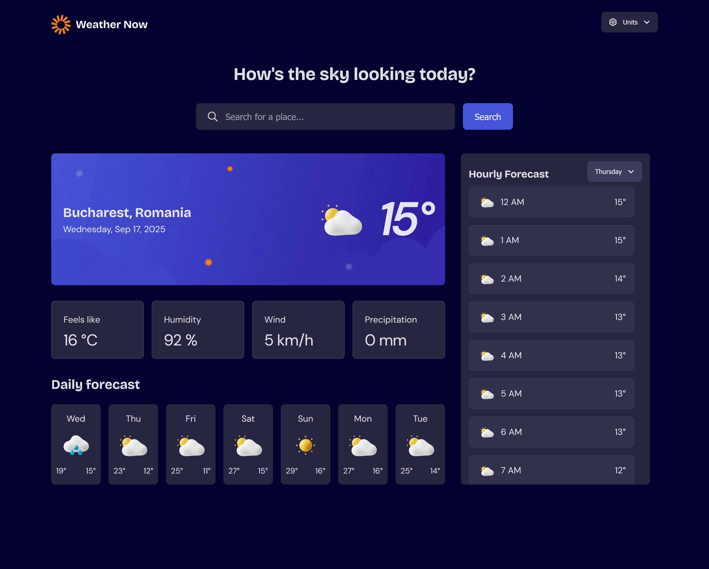
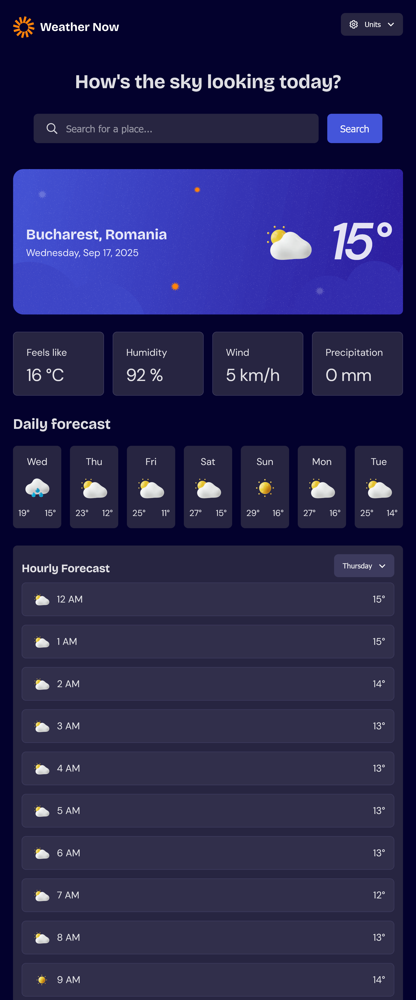
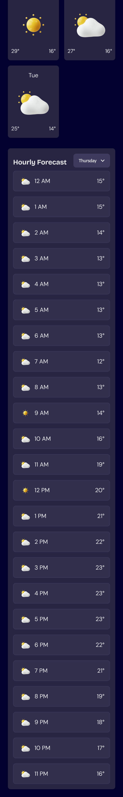

# Frontend Mentor - Weather app solution

This is a solution to the [Weather app challenge on Frontend Mentor](https://www.frontendmentor.io/challenges/weather-app-K1FhddVm49). Frontend Mentor challenges help you improve your coding skills by building realistic projects. 

## Table of contents

- [Overview](#overview)
  - [The challenge](#the-challenge)
  - [Screenshot](#screenshot)
  - [Links](#links)
- [My process](#my-process)
  - [Built with](#built-with)
  - [What I learned](#what-i-learned)
  - [Continued development](#continued-development)
  - [Useful resources](#useful-resources)
- [Author](#author)
- [Acknowledgments](#acknowledgments)

**Note: Delete this note and update the table of contents based on what sections you keep.**

## Overview

### The challenge

Users should be able to:

- Search for weather information by entering a location in the search bar
- View current weather conditions including temperature, weather icon, and location details
- See additional weather metrics like "feels like" temperature, humidity percentage, wind speed, and precipitation amounts
- Browse a 7-day weather forecast with daily high/low temperatures and weather icons
- View an hourly forecast showing temperature changes throughout the day
- Switch between different days of the week using the day selector in the hourly forecast section
- Toggle between Imperial and Metric measurement units via the units dropdown 
- Switch between specific temperature units (Celsius and Fahrenheit) and measurement units for wind speed (km/h and mph) and precipitation (millimeters) via the units dropdown
- View the optimal layout for the interface depending on their device's screen size
- See hover and focus states for all interactive elements on the page

### Screenshot





### Links

- Solution URL: [Add solution URL here](https://github.com/Fanushhh/weather-app)
- Live Site URL: [Add live site URL here](https://weather-app-one-amber-nca1f2zj7p.vercel.app/)

## My process

### Built with

- Semantic HTML5 markup
- CSS Modules
- Flexbox
- CSS Grid
- [React](https://reactjs.org/) - JS library
- Tanstack Query


### What I learned

I learned a bit more about data manipulation, especially working with dates. It's been a pain but also a welcome challenge to figure out how to work with the OpenWeather API, figure out a way to split the hours array into day arrays that I can show when a user switches the day. 
I also enjoyed figuring out what icon to show based on the weather code, that was nice, allowing the user to change between temperature units, wind speed units and precipitation units without switch the whole units module to imperial/metric.

Here's a snipped from my successful attempt to split hours array into hours per day arrays:
```js
export function getDaily24HourForecast(
  data,
  currentDayIndex = 0,
  currentHourIndex = 13
) {
  const hourlyForecast = {};
  const startIndex =
    currentDayIndex === 0 ? currentHourIndex : currentDayIndex * 24;
  const endIndex = currentDayIndex === 0 ? 24 : currentDayIndex * 24 + 24;
  hourlyForecast.time = data.hourly.time.slice(startIndex, endIndex);
  hourlyForecast.temperature = data.hourly.temperature_2m.slice(
    startIndex,
    endIndex
  );
  hourlyForecast.weatherCode = data.hourly.weather_code.slice(
    startIndex,
    endIndex
  );

  return hourlyForecast;
}

```
Making the dropdown a reusable component was also a welcome and intriguing challenge, here's a sneak peek:

```js
export const Dropdown = ({
  children,
  isUnits,
  isSearch,
  buttonText,
  lightColor,
}) => {
  const { isOpen, setIsOpen, containerRef, closeBtnRef } = useIsOpen(false);

  return (
    <div className={styles.dropdown}>
      <button
        ref={closeBtnRef}
        onClick={() => setIsOpen(!isOpen)}
        className={`${styles.dropbtn} ${lightColor ? styles.lightColor : ""}`}
        type="button"
      >
        {isUnits && (
          
        )}
        {buttonText}
        
      </button>
      <div
        ref={containerRef}
        className={`${styles.dropdownContent} ${
          isOpen || isSearch ? styles.show : ""
        } ${lightColor ? styles.lightColor : ""}`}
      >
        {children}
      </div>
    </div>
  );
};
```


CSS wise I don't really have anything special, mostly just proud I still remembered how to stylize :D


```js
const proudOfThisFunc = () => {
  console.log('🎉')
}
```


### Useful resources

- [Open Meteo API](https://open-meteo.com/en/docs) - This helped me a lot because I was able to toggle stuff, tinker with various options to figure out how and what exactly should I request. They don't however have a geolocation api to allow you to search by the name of the city, you need the latitude and longitude to get the weather data, which makes the next link important as well.
- [Reverse geocode client](https://api.bigdatacloud.net/data/reverse-geocode-client) - This is helpful for getting the city name based on latitude and longitude.'
- [What is debouce and how to implement it](https://levelup.gitconnected.com/debounce-from-scratch-8616c8209b54) - Great resource

## Author

- Website - [Fanush Mihailescu](Fanush.work)
- Frontend Mentor - [@Fanushhh](https://www.frontendmentor.io/profile/Fanushhh)


